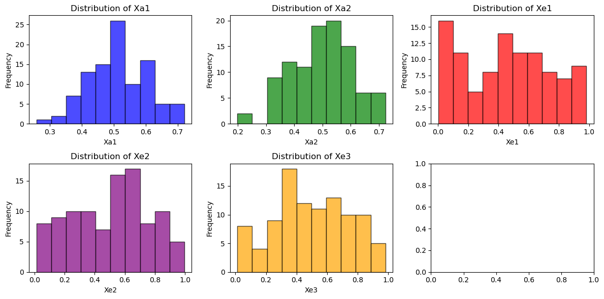
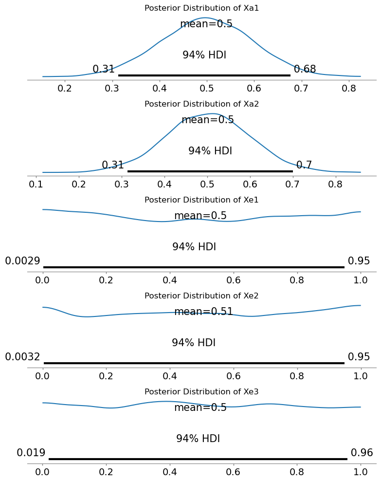

 
<h2>Initial UQ Quantification Model using Bayesian MCMC</h2> 

This model quantifies uncertainty in two aleatory variables Xa1 and Xa2 as well as the three epistemic variables Xe1, Xe2, Xe3 using Bayesian Markov Chain Monte-Carlo (MCMC) sampling.

<h3>Problem:</h3>
Given the back-box local simulation model that takes aleatory variables Xa1, Xa2, epistemic variables Xe1, Xe2, Xe3, three control variables Xc1, Xc2, Xc3 (control variables are assumed to be constants for this UQ problem) and provides time varying series of outputs (60 time-steps) Y1, Y2, Y3, Y4, Y5, Y6, create an uncertinty model for aleatory and epistemic input variables.

<h3>Theory:</h3>
Using Bayes Theorem:

  

- P(X) is the prior distribution assumed for each of the aleatory and epistemic variables. For aleatory initial model assumes distribution is normal truncated for the interval [0,1]. Each epistemic variable is assumed to follow a uniform distribution in the interval [0,1]  

- P(Y|X) is the likelihood, which is given by the time-series output of the black-box local model for a set of given inputs.
   
- P(Y) is the normalising constant representing the marginal probability. Since it is difficult to calculate this MCMC is used to approximate the posterior.
  
- P(X|Y) is the posterior distributions for the aleatory and epistemic variables and represents the uncertainty in each input variable. They are found through MCMC sampling.

<h3>Implementing the solution:</h3>

  

- Solution is implemented in the following Jupyter Notebook - model1_bayesian_mcmc.ipynb, PyMC is used to create MCMC samples.  

- Local model is executed using the run_model.py script, that takes samples form X variables in input3.txt file. Local model executable provided by the UQ Challenge organisers write output to Y_out.csv file.

<h3>Outputs:</h3>  

- Priors - following histograms shows the prior samples created from the normal (for aleatory) and uniform (for epistemic) distributions. Only 100 samples were used initially since each sample required a local black-box model invocation.  

- Posteriors obtained after running the model - following diagrams show posterior distributions obtained after running the MCMC model.
  

